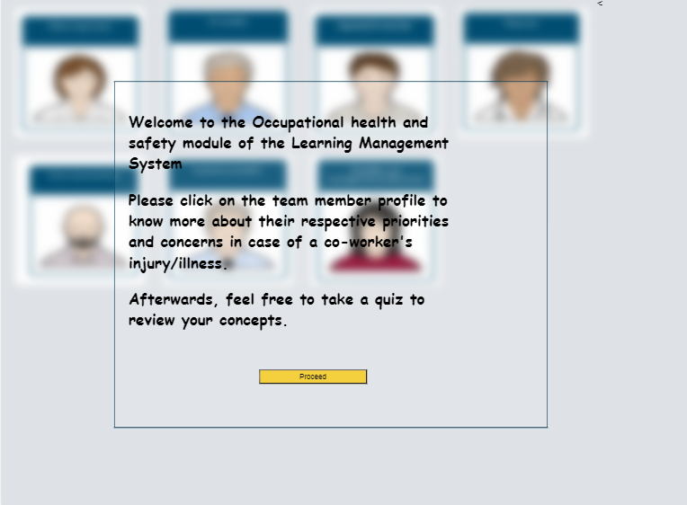
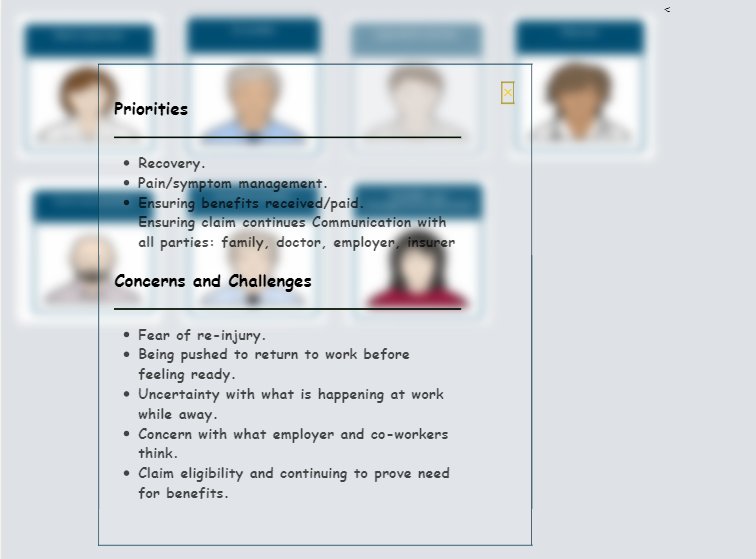
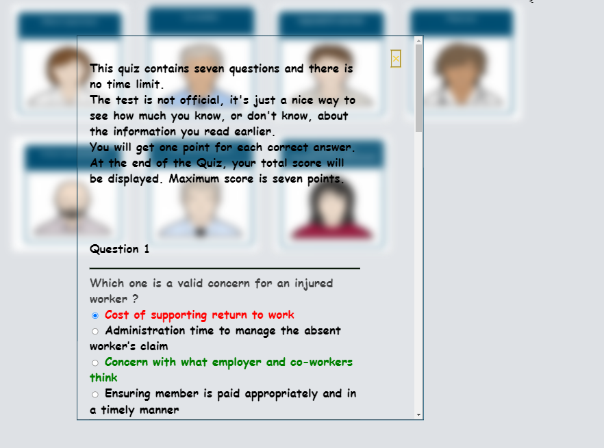

This web page serves as a module for a Learning Management System (LMS) that focuses on occupational health and safety. The main goal of this module is to educate students about the priorities and concerns of team members in case of a co-worker's injury/illness. 

This UX of this web page is adapted to provide a desirable experience on popular screen resolutions to maximize audience engagement. 

<h3> Landing Page Preview </h1>

 Simply clicking on the team member profile would show their concerns and priorities.

 Afterwards, users can opt to take a quiz to review their grasp on educational material.

Please redirect any queries to [Sidd Chugh](mailto:sidd032@gmail.com)